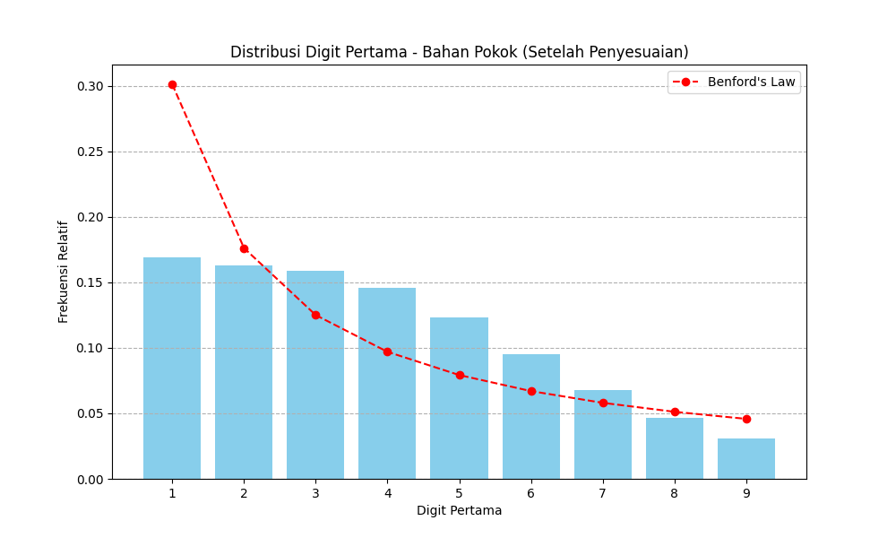
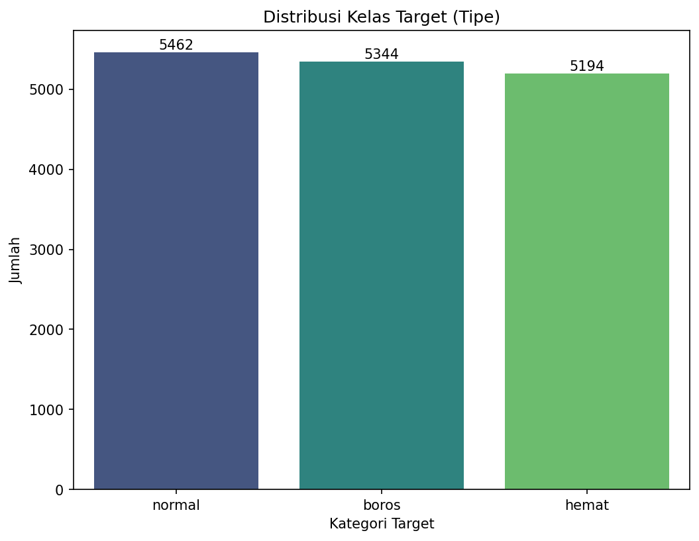
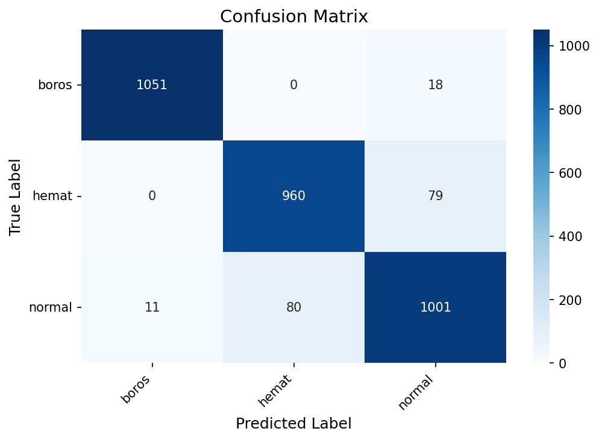
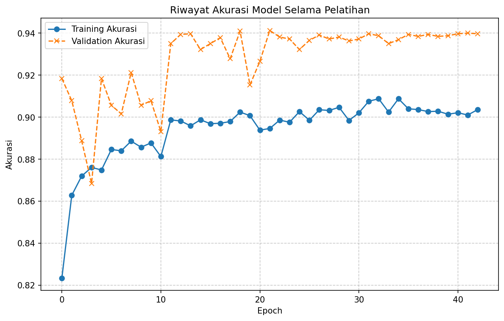

# Dompet Juara - Klasifikasi Perilaku Keuangan 🏆💸

[](https://www.python.org/downloads/)
[](https://www.tensorflow.org/)
[](https://keras.io/keras_tuner/)
[](https://opensource.org/licenses/MIT)
[](https://github.com/psf/black)
<!-- Tambahkan badge lain sesuai kebutuhan, mis., status build -->
<!-- [](https://github.com/dompet-juara/machine-learning/actions) -->

"Dompet Juara" adalah proyek *machine learning* yang dirancang untuk mengklasifikasikan perilaku keuangan individu berdasarkan pola pendapatan dan pengeluaran mereka. Proyek ini menggunakan dataset yang dihasilkan secara sintetis dan *Neural Network* (Jaringan Saraf Tiruan), yang dioptimalkan dengan `Keras Tuner`, untuk mengkategorikan perilaku menjadi 'boros', 'hemat', dan 'normal'. Proyek ini bertujuan untuk memberikan wawasan tentang kebiasaan keuangan melalui *pipeline ML* yang tangguh dan dapat direproduksi.

## 📖 Daftar Isi

*   [✨ Fitur Utama](#-fitur-utama)
*   [📝 Gambaran Umum Proyek](#-gambaran-umum-proyek)
*   [🛠️ Tumpukan Teknologi (*Tech Stack*)](#️-tumpukan-teknologi-tech-stack)
*   [📊 Dataset](#-dataset)
*   [🖼️ Visualisasi](#️-visualisasi)
*   [📂 Struktur Proyek](#-struktur-proyek)
*   [⚙️ Pengaturan dan Instalasi](#️-pengaturan-dan-instalasi)
    *   [Prasyarat](#prasyarat)
    *   [Gandakan Repositori (*Clone Repository*)](#gandakan-repositori-clone-repository)
    *   [Siapkan Lingkungan Virtual (*Virtual Environment*)](#siapkan-lingkungan-virtual-virtual-environment)
    *   [Instal Dependensi](#instal-dependensi)
*   [🚀 Penggunaan / Memulai](#-penggunaan--memulai)
    *   [1. Hasilkan Dataset (jika belum ada)](#1-hasilkan-dataset-jika-belum-ada)
    *   [2. Jalankan *Pipeline* Lengkap (Skrip)](#2-jalankan-pipeline-lengkap-skrip)
    *   [3. Jalankan melalui `Jupyter Notebook`](#3-jalankan-melalui-jupyter-notebook)
*   [📈 Hasil / Performa](#-hasil--performa)
*   [🧪 Pengujian dengan Data Manual](#-pengujian-dengan-data-manual)
*   [🤝 Berkontribusi](#-berkontribusi)
*   [📜 Lisensi](#-lisensi)
*   [🙏 Ucapan Terima Kasih](#-ucapan-terima-kasih)
*   [📧 Kontak / Penulis](#-kontak--penulis)

## ✨ Fitur Utama

*   **Klasifikasi Perilaku Keuangan**: Mengkategorikan pengguna menjadi 'boros', 'hemat', atau 'normal' berdasarkan data keuangan.
*   **Pembuatan Data Sintetis**: Menyertakan skrip (`modules/generate_data.py`) untuk membuat dataset keuangan yang kaya dan dapat disesuaikan, dengan upaya mengikuti *Benford's Law* untuk realisme.
*   **Model *Neural Network***: Menggunakan model *deep learning* yang dibangun dengan `TensorFlow` dan `Keras` untuk klasifikasi.
*   **Optimasi *Hyperparameter***: Menggunakan `Keras Tuner` (algoritma `Hyperband`) untuk secara otomatis menemukan arsitektur dan parameter pembelajaran yang optimal untuk *Neural Network*.
*   ***Pipeline* Modular & Dapat Direproduksi**: Menampilkan *pipeline* yang terstruktur dengan baik dengan modul-modul terpisah untuk pembuatan data, pemuatan, *EDA*, pra-pemrosesan, pelatihan model, dan evaluasi.
*   ***EDA* Komprehensif**: Menghasilkan berbagai plot (distribusi, *boxplot*, *heatmap*) untuk pemahaman data yang mendalam.
*   ***Callback* Pelatihan Lanjutan**: Menggunakan `ModelCheckpoint`, `EarlyStopping`, `ReduceLROnPlateau`, dan `TensorBoard` untuk pelatihan model yang efisien dan efektif.
*   **Evaluasi Mendetail**: Menyediakan metrik performa, laporan klasifikasi, *confusion matrix*, dan visualisasi riwayat pelatihan.

## 📝 Gambaran Umum Proyek

Tujuan utama "Dompet Juara" adalah untuk mengembangkan sistem yang mampu memahami dan memprediksi kebiasaan keuangan individu dengan mengklasifikasikannya ke dalam kategori yang telah ditentukan:
*   **Boros**: Individu yang cenderung berbelanja berlebihan atau boros.
*   **Hemat**: Individu yang berhati-hati dengan pengeluaran mereka dan memprioritaskan tabungan.
*   **Normal**: Individu dengan kebiasaan pengeluaran dan tabungan yang seimbang.

Proyek ini mengatasi tantangan tersebut dengan:
1.  **Menghasilkan Dataset Sintetis**: Karena data keuangan dunia nyata dengan label seperti itu langka dan bersifat pribadi, modul pembuatan data sintetis yang tangguh (`modules/generate_data.py`) digunakan. Modul ini membuat `N_SAMPLES` (misalnya, 16.000) catatan, menyimulasikan sumber pendapatan dan berbagai kategori pengeluaran, dengan proporsi yang berbeda berdasarkan tipe pengguna.
2.  **Melakukan *EDA* Mendalam**: Skrip `modules/eda.py` melakukan *Exploratory Data Analysis* (*EDA*) yang menyeluruh untuk mengungkap pola, distribusi, dan korelasi dalam dataset yang dihasilkan.
3.  **Pra-pemrosesan Data**: `modules/preprocessing.py` menangani langkah-langkah pra-pemrosesan penting, termasuk `LabelEncoding` dan `One-Hot Encoding` untuk variabel target kategorikal (`Tipe`), dan `StandardScaler` untuk fitur numerik guna mempersiapkan data untuk *Neural Network*.
4.  **Mengoptimalkan Arsitektur Model**: `modules/training.py` memanfaatkan `Keras Tuner` dengan *hypermodel* yang didefinisikan dalam `modules/model_builder.py`. Ini secara otomatis mencari kombinasi terbaik dari *hidden layers*, unit per lapisan, fungsi aktivasi, *dropout rates*, dan *learning rates*.
5.  **Melatih dan Mengevaluasi Model**: Konfigurasi model terbaik yang ditemukan oleh `Keras Tuner` kemudian dilatih secara komprehensif. Skrip `modules/evaluation.py` menilai kinerjanya pada set pengujian menggunakan metrik seperti *accuracy*, *loss*, *precision*, *recall*, *F1-score*, dan memvisualisasikan hasil melalui *confusion matrix* dan plot riwayat pelatihan.
6.  **Memastikan Reproduktifitas**: Proyek ini menggunakan *random seed* tetap (`config.SEED = 42`) dan alur kerja modular yang terstruktur untuk memastikan bahwa hasil dapat direproduksi.

Signifikansi proyek ini terletak pada pendekatan *end-to-end* untuk membangun pengklasifikasi perilaku keuangan, mulai dari pembuatan data hingga kesiapan *deployment* model, dengan menekankan praktik terbaik dalam pengembangan *ML*.

## 🛠️ Tumpukan Teknologi (*Tech Stack*)

*   **Bahasa Pemrograman**: `Python` 3.9+
*   **Framework *ML/DL* Utama**:
    *   `TensorFlow` 2.x (dengan `Keras API`)
    *   `Keras Tuner` (`Hyperband`)
*   **Pustaka Kunci**:
    *   `Pandas`: Untuk manipulasi dan analisis data.
    *   `NumPy`: Untuk operasi numerik.
    *   `Scikit-learn`: Untuk pra-pemrosesan (`StandardScaler`, `LabelEncoder`, `train_test_split`) dan metrik evaluasi (`classification_report`, `confusion_matrix`).
    *   `Matplotlib` & `Seaborn`: Untuk visualisasi data.
*   **Alat Pengembangan**:
    *   `Jupyter Notebooks` (`main.ipynb`): Untuk pengembangan interaktif, eksperimen, dan visualisasi.
    *   `Git` & `GitHub`: Untuk kontrol versi dan kolaborasi.
*   **Konfigurasi**:
    *   Konfigurasi terpusat melalui `modules/config.py`.

## 📊 Dataset

*   **Nama**: Dataset Keuangan
*   **Sumber**: Dihasilkan secara sintetis oleh skrip `modules/generate_data.py` dalam proyek ini.
*   **Lokasi**: Disimpan sebagai `data/dataset_keuangan.csv` setelah pembuatan (dapat dikonfigurasi melalui `config.DATA_FILEPATH`).
*   **Deskripsi Singkat**: Dataset berisi `N_SAMPLES` (misalnya, 16.000) catatan keuangan simulasi. Fitur utama meliputi:
    *   **Fitur Pendapatan**: `Gaji`, `Tabungan Lama`, `Investasi`, `Pemasukan Lainnya`.
    *   **Fitur Pengeluaran**: `Bahan Pokok`, `Protein & Gizi Tambahan`, `Tempat Tinggal`, `Sandang`, `Konsumsi Praktis`, `Barang & Jasa Sekunder`, `Pengeluaran Tidak Esensial`, `Pajak`, `Asuransi`, `Sosial & Budaya`, `Tabungan / Investasi` (baru).
    *   **Variabel Target**: `Tipe` - Kategorikal, dengan tiga kelas: 'boros', 'hemat', 'normal'.
*   **Catatan Akses/Pra-pemrosesan**:
    *   Dataset dihasilkan dengan menjalankan `python modules/generate_data.py` (dari *terminal*) atau sel pertama di `main.ipynb`.
    *   Langkah-langkah pra-pemrosesan (penskalaan fitur numerik, pengkodean variabel target) ditangani oleh skrip `modules/preprocessing.py` sebagai bagian dari *pipeline* utama (`main.py` atau `main.ipynb`).

## 🖼️ Visualisasi

Proyek ini menghasilkan berbagai visualisasi, disimpan dalam direktori `image/` (dapat dikonfigurasi melalui `config.IMAGE_DIR`), untuk membantu dalam memahami data dan performa model. Ini termasuk:

*   `distribusi_digit_bahan_pokok.png`: Analisis *Benford's Law* pada sampel kategori pengeluaran selama pembuatan data.
*   `target_distribution_countplot.png` & `target_distribution_pie.png`: Distribusi variabel target ('Tipe').
*   `dist_*.png` (mis., `dist_gaji.png`): Histogram dan plot kepadatan untuk fitur numerik.
*   `numerical_features_boxplot_vs_target.png`: *Boxplot* fitur numerik yang dikelompokkan berdasarkan variabel target.
*   `correlation_heatmap.png`: *Heatmap* yang menunjukkan korelasi antar fitur numerik.
*   `confusion_matrix.png`: *Confusion matrix* untuk performa model pada set pengujian.
*   `training_akurasi_history.png`: Plot *accuracy* pelatihan dan validasi selama *epoch*.
*   `training_loss_history.png`: Plot *loss* pelatihan dan validasi selama *epoch*.




## 📂 Struktur Proyek

```
dompet-juara-machine-learning/
├── data/
│   └── dataset_keuangan.csv        # Dataset keuangan yang dihasilkan
├── image/
│   ├── confusion_matrix.png
│   ├── training_akurasi_history.png
│   └── ...                         # Plot lain yang dihasilkan
├── logs/
│   └── fit/
│       └── financial_classification/ # Log TensorBoard dari pelatihan
├── model/
│   ├── best_model.keras            # Model Keras terbaik yang disimpan setelah pelatihan
│   └── keras_tuner_dir/            # Artefak percobaan Keras Tuner
│       └── financial_classification/
├── modules/
│   ├── __init__.py
│   ├── config.py                   # Konfigurasi (path, hyperparameter)
│   ├── data_loader.py              # Pemuatan data dan inspeksi awal
│   ├── eda.py                      # Fungsi Exploratory Data Analysis (EDA)
│   ├── evaluation.py               # Evaluasi model dan pengujian manual
│   ├── generate_data.py            # Skrip pembuatan dataset sintetis
│   ├── model_builder.py            # Mendefinisikan hypermodel untuk Keras Tuner
│   ├── preprocessing.py            # Fungsi pra-pemrosesan data
│   ├── training.py                 # Pengaturan Keras Tuner dan logika pelatihan model
│   └── utils.py                    # Fungsi utilitas (seed, direktori, plotting)
├── .gitignore
├── LICENSE                         # Lisensi Proyek
├── main.ipynb                      # Jupyter Notebook untuk pipeline ML lengkap
├── main.py                         # Skrip Python utama untuk menjalankan pipeline lengkap
├── README.md                       # File ini
└── requirements.txt                # Dependensi proyek
```

## ⚙️ Pengaturan dan Instalasi

### Prasyarat

*   `Python` 3.9 atau lebih tinggi
*   `pip` (penginstal paket `Python`) atau `conda`
*   `Git` (untuk menggandakan repositori)
*   `NVIDIA GPU` dengan driver `CUDA` dan `cuDNN` yang sesuai terinstal. Lihat [panduan pengaturan GPU TensorFlow](https://www.tensorflow.org/install/gpu).

### Gandakan Repositori (*Clone Repository*)

```bash
git clone https://github.com/dompet-juara/machine-learning.git
cd machine-learning
```

### Siapkan Lingkungan Virtual (*Virtual Environment*)

Sangat disarankan untuk menggunakan lingkungan virtual untuk mengelola dependensi proyek.

**Menggunakan `venv` (`Python` standar):**
```bash
# Buat lingkungan virtual
python -m venv venv

# Aktifkan lingkungan virtual
# Di Windows:
venv\Scripts\activate
# Di macOS/Linux:
source venv/bin/activate
```

**Menggunakan `conda`:**
```bash
# Buat lingkungan conda (ganti 'dompetjuara_env' dengan nama pilihan Anda)
conda create --name dompetjuara_env python=3.9 -y

# Aktifkan lingkungan conda
conda activate dompetjuara_env
```

### Instal Dependensi

Setelah lingkungan virtual Anda diaktifkan, instal paket yang diperlukan dari `requirements.txt`:
```bash
pip install -r requirements.txt
```
File `requirements.txt` seharusnya berisi:
```
tensorflow>=2.8.0
keras-tuner>=1.1.0
pandas>=1.3.0
numpy>=1.21.0
scikit-learn>=1.0.0
matplotlib>=3.4.0
seaborn>=0.11.0
```

## 🚀 Penggunaan / Memulai

Ada beberapa cara untuk menjalankan proyek ini:

### 1. Hasilkan Dataset (jika belum ada)

Jika file `data/dataset_keuangan.csv` (path didefinisikan dalam `config.DATA_FILEPATH`) tidak ada, Anda perlu menghasilkannya terlebih dahulu. Langkah ini juga disertakan sebagai sel pertama di `main.ipynb`.

Dari *root directory* proyek:
```bash
python modules/generate_data.py
```
Ini akan membuat `data/dataset_keuangan.csv` dan visualisasi awal (`image/distribusi_digit_bahan_pokok.png`).

### 2. Jalankan *Pipeline* Lengkap (Skrip)

Skrip `main.py` menjalankan seluruh *pipeline ML*: pemuatan data, *EDA*, pra-pemrosesan, penyetelan *hyperparameter*, pelatihan model, evaluasi, dan pengujian dengan data manual.

Dari *root directory* proyek:
```bash
python main.py
```
Output, log, model, dan gambar akan dihasilkan di direktori masing-masing (`logs/`, `model/`, `image/`) seperti yang dikonfigurasi dalam `modules/config.py`.

### 3. Jalankan melalui `Jupyter Notebook`

Untuk pengalaman yang lebih interaktif dan untuk melihat eksekusi langkah demi langkah serta outputnya, Anda dapat menggunakan `Jupyter Notebook` `main.ipynb`.

1.  Pastikan `Jupyter Notebook` atau `Jupyter Lab` terinstal (mis., `pip install notebook jupyterlab`).
2.  Mulai `Jupyter` dari *root directory* proyek:
    ```bash
    jupyter notebook
    ```
    atau
    ```bash
    jupyter lab
    ```
3.  Buka `main.ipynb` dari antarmuka `Jupyter`.
4.  Jalankan sel secara berurutan. *Notebook* mencakup:
    *   Pembuatan Dataset (jika perlu)
    *   Pengaturan Awal (impor, *seed*, pembuatan direktori)
    *   Pemuatan dan Inspeksi Data
    *   *Exploratory Data Analysis* (*EDA*)
    *   Pra-pemrosesan Data
    *   Pembangunan Model *Neural Network* dengan `Keras Tuner`
    *   Pelatihan Model Terbaik
    *   Evaluasi Model
    *   Pengujian dengan Data Manual

## 📈 Hasil / Performa

Setelah menjalankan *pipeline* (`main.py` atau `main.ipynb`), performa model pada set pengujian dievaluasi. Berdasarkan contoh output dari *notebook*:

*   **Test Accuracy**: Sekitar **94.25%**
*   **Test Loss**: Sekitar **0.1947**

**Laporan Klasifikasi (*Classification Report*) :**
```
              precision    recall  f1-score   support

       boros       0.99      0.99      0.99      1069
       hemat       0.92      0.93      0.93      1039
      normal       0.92      0.91      0.92      1092

    accuracy                           0.94      3200
   macro avg       0.94      0.94      0.94      3200
weighted avg       0.94      0.94      0.94      3200
```
***Confusion Matrix* :**


**Riwayat Akurasi Pelatihan :**


Log `TensorBoard` disimpan di `logs/fit/financial_classification` (path didefinisikan dalam `config.LOG_DIR_FIT`). Anda dapat memvisualisasikannya dengan menjalankan:
```bash
tensorboard --logdir logs/fit/financial_classification
```
Kemudian, navigasikan ke URL yang disediakan di *terminal* Anda (biasanya `http://localhost:6006`).

## 🧪 Pengujian dengan Data Manual

*Pipeline* menyertakan langkah (`evaluation.test_with_manual_data()`) untuk menguji model yang telah dilatih dengan data sampel yang dibuat secara manual. Ini menunjukkan bagaimana model akan berperforma pada input baru yang belum pernah dilihat. Fungsi ini menampilkan data input, data yang telah diskalakan, dan prediksi model beserta probabilitas kelas.

Contoh output untuk data uji manual (dari *notebook*):
```
--- Hasil Prediksi pada Data Buatan ---
       Gaji  Tabungan Lama  Investasi  ... Predicted_Tipe  Prob_boros  Prob_hemat  Prob_normal
0  15000000       50000000   20000000  ...          hemat    0.006058    0.988806     0.005136
1   7000000        5000000    1000000  ...         normal    0.252476    0.022271     0.725252
2  10000000       20000000    5000000  ...          hemat    0.012489    0.631481     0.356030
```

## 🤝 Berkontribusi

Kontribusi sangat diterima! Jika Anda ingin berkontribusi pada Dompet Juara, silakan ikuti langkah-langkah berikut:

1.  **Fork repositori** di `GitHub`: [https://github.com/dompet-juara/machine-learning.git](https://github.com/dompet-juara/machine-learning.git)
2.  **Buat *branch* baru** untuk fitur atau perbaikan *bug* Anda:
    ```bash
    git checkout -b feature/your-awesome-feature
    ```
    atau
    ```bash
    git checkout -b fix/address-issue-XX
    ```
3.  **Lakukan perubahan Anda** dan *commit* dengan pesan yang jelas dan deskriptif.
4.  **Pastikan kode Anda mematuhi standar proyek** (mis., jalankan *formatter* seperti `Black` jika digunakan).
5.  ***Push* perubahan Anda** ke repositori *fork* Anda:
    ```bash
    git push origin feature/your-awesome-feature
    ```
6.  **Buka *Pull Request* (PR)** ke *branch* `main` dari repositori `dompet-juara/machine-learning`.
    *   Berikan judul dan deskripsi yang jelas untuk PR Anda.
    *   Referensi isu yang relevan jika ada.

Silakan buka isu terlebih dahulu untuk membahas perubahan signifikan atau fitur baru yang Anda rencanakan untuk diimplementasikan.

## 📜 Lisensi

Proyek ini dilisensikan di bawah [**Lisensi MIT**](https://github.com/dompet-juara/machine-learning/blob/main/LICENSE).

## 🙏 Ucapan Terima Kasih

*   Proyek ini memanfaatkan kekuatan berbagai pustaka *open-source* termasuk `TensorFlow`, `Keras`, `Scikit-learn`, `Pandas`, `NumPy`, `Matplotlib`, dan `Seaborn`.
*   Proses pembuatan data sintetis dan struktur *pipeline ML* modular terinspirasi oleh praktik terbaik umum dalam komunitas *machine learning*.

## 📧 Kontak / Penulis

*   **Tim Proyek**: Dompet Juara
*   **Organisasi `GitHub`**: [https://github.com/dompet-juara](https://github.com/dompet-juara)
*   **Email**: juaradompet@gmail.com
