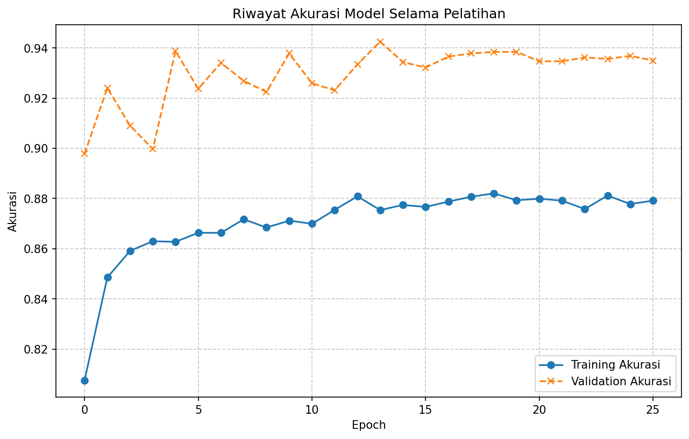

# Dompet Juara - Financial Behavior Classification 🏆💸

[](https://www.python.org/downloads/)
[](https://www.tensorflow.org/)
[](https://keras.io/keras_tuner/)
[](https://opensource.org/licenses/MIT)
[](https://github.com/psf/black)
<!-- Add other badges as needed, e.g., build status -->
<!-- [](https://github.com/dompet-juara/machine-learning/actions) -->

"Dompet Juara" (Champion Wallet) is a machine learning project designed to classify individuals' financial behavior based on their income and expenditure patterns. It utilizes a synthetically generated dataset and a Neural Network, optimized with Keras Tuner, to categorize behavior into 'boros' (spendthrift), 'hemat' (frugal), and 'normal'. The project aims to provide insights into financial habits through a robust and reproducible ML pipeline.

## 📖 Table of Contents

*   [✨ Key Features](#-key-features)
*   [📝 Project Overview](#-project-overview)
*   [🛠️ Tech Stack](#️-tech-stack)
*   [📊 Dataset](#-dataset)
*   [🖼️ Visualizations](#️-visualizations)
*   [📂 Project Structure](#-project-structure)
*   [⚙️ Setup and Installation](#️-setup-and-installation)
    *   [Prerequisites](#prerequisites)
    *   [Clone Repository](#clone-repository)
    *   [Setup Virtual Environment](#setup-virtual-environment)
    *   [Install Dependencies](#install-dependencies)
*   [🚀 Usage / Getting Started](#-usage--getting-started)
    *   [1. Generate Dataset (if not present)](#1-generate-dataset-if-not-present)
    *   [2. Run the Full Pipeline (Script)](#2-run-the-full-pipeline-script)
    *   [3. Run via Jupyter Notebook](#3-run-via-jupyter-notebook)
*   [📈 Results / Performance](#-results--performance)
*   [🧪 Testing with Manual Data](#-testing-with-manual-data)
*   [🤝 Contributing](#-contributing)
*   [📜 License](#-license)
*   [🙏 Acknowledgements](#-acknowledgements)
*   [📧 Contact / Authors](#-contact--authors)

## ✨ Key Features

*   **Financial Behavior Classification**: Categorizes users into 'boros' (spendthrift), 'hemat' (frugal), or 'normal' based on financial data.
*   **Synthetic Data Generation**: Includes a script (`modules/generate_data.py`) to create a rich, customizable financial dataset, with an attempt to follow Benford's Law for realism.
*   **Neural Network Model**: Employs a deep learning model built with TensorFlow and Keras for classification.
*   **Hyperparameter Optimization**: Uses Keras Tuner (Hyperband algorithm) to automatically find the optimal architecture and learning parameters for the neural network.
*   **Modular & Reproducible Pipeline**: Features a well-structured pipeline with distinct modules for data generation, loading, EDA, preprocessing, model training, and evaluation.
*   **Comprehensive EDA**: Generates various plots (distributions, boxplots, heatmaps) for in-depth data understanding.
*   **Advanced Training Callbacks**: Utilizes ModelCheckpoint, EarlyStopping, ReduceLROnPlateau, and TensorBoard for efficient and effective model training.
*   **Detailed Evaluation**: Provides performance metrics, classification reports, confusion matrices, and training history visualizations.

## 📝 Project Overview

The primary goal of "Dompet Juara" is to develop a system capable of understanding and predicting individual financial habits by classifying them into predefined categories:
*   **Boros (Spendthrift)**: Individuals who tend to overspend or spend lavishly.
*   **Hemat (Frugal)**: Individuals who are careful with their spending and prioritize saving.
*   **Normal**: Individuals with balanced spending and saving habits.

This project addresses the challenge by:
1.  **Generating a Synthetic Dataset**: Since real-world financial data with such labels can be scarce and private, a robust synthetic data generation module (`modules/generate_data.py`) is used. This module creates `N_SAMPLES` (e.g., 16,000) records, simulating income sources and various expense categories, with different proportions based on user types.
2.  **Performing In-depth EDA**: The `modules/eda.py` script conducts a thorough exploratory data analysis to uncover patterns, distributions, and correlations within the generated dataset.
3.  **Preprocessing Data**: `modules/preprocessing.py` handles essential preprocessing steps, including LabelEncoding and One-Hot Encoding for the categorical target variable (`Tipe`), and StandardScaler for numerical features to prepare data for the neural network.
4.  **Optimizing Model Architecture**: `modules/training.py` leverages Keras Tuner with a hypermodel defined in `modules/model_builder.py`. This automatically searches for the best combination of hidden layers, units per layer, activation functions, dropout rates, and learning rates.
5.  **Training and Evaluating the Model**: The best model configuration found by Keras Tuner is then trained comprehensively. The `modules/evaluation.py` script assesses its performance on a test set using metrics like accuracy, loss, precision, recall, F1-score, and visualizes results through confusion matrices and training history plots.
6.  **Ensuring Reproducibility**: The project uses fixed random seeds (`config.SEED = 42`) and a structured, modular workflow to ensure that results can be reproduced.

The significance of this project lies in its end-to-end approach to building a financial behavior classifier, from data generation to model deployment readiness, emphasizing best practices in ML development.

## 🛠️ Tech Stack

*   **Programming Language**: Python 3.9+
*   **Main ML/DL Frameworks**:
    *   TensorFlow 2.x (with Keras API)
    *   Keras Tuner (Hyperband)
*   **Key Libraries**:
    *   Pandas: For data manipulation and analysis.
    *   NumPy: For numerical operations.
    *   Scikit-learn: For preprocessing (StandardScaler, LabelEncoder, train_test_split) and evaluation metrics (classification_report, confusion_matrix).
    *   Matplotlib & Seaborn: For data visualization.
*   **Development Tools**:
    *   Jupyter Notebooks (`main.ipynb`): For interactive development, experimentation, and visualization.
    *   Git & GitHub: For version control and collaboration.
*   **Configuration**:
    *   Centralized configuration via `modules/config.py`.

## 📊 Dataset

*   **Name**: Dataset Keuangan (Financial Dataset)
*   **Source**: Synthetically generated by the `modules/generate_data.py` script within this project.
*   **Location**: Saved as `data/dataset_keuangan.csv` after generation (configurable via `config.DATA_FILEPATH`).
*   **Brief Description**: The dataset contains `N_SAMPLES` (e.g., 16,000) simulated financial records. Key features include:
    *   **Income Features**: `Gaji` (Salary), `Tabungan Lama` (Old Savings), `Investasi` (Investment), `Pemasukan Lainnya` (Other Income).
    *   **Expense Features**: `Bahan Pokok` (Staples), `Protein & Gizi Tambahan` (Protein & Supplements), `Tempat Tinggal` (Housing), `Sandang` (Clothing), `Konsumsi Praktis` (Convenience Consumption), `Barang & Jasa Sekunder` (Secondary Goods & Services), `Pengeluaran Tidak Esensial` (Non-Essential Spending), `Pajak` (Tax), `Asuransi` (Insurance), `Sosial & Budaya` (Social & Cultural), `Tabungan / Investasi` (Savings / New Investment).
    *   **Target Variable**: `Tipe` (Type) - Categorical, with three classes: 'boros', 'hemat', 'normal'.
*   **Access/Preprocessing Notes**:
    *   The dataset is generated by running `python modules/generate_data.py` (from the terminal) or the first cell in `main.ipynb`.
    *   Preprocessing steps (scaling numerical features, encoding the target variable) are handled by the `modules/preprocessing.py` script as part of the main pipeline (`main.py` or `main.ipynb`).

## 🖼️ Visualizations

The project generates various visualizations, saved in the `image/` directory (configurable via `config.IMAGE_DIR`), to aid in understanding the data and model performance. These include:

*   `distribusi_digit_bahan_pokok.png`: Benford's Law analysis on a sample expense category during data generation.
*   `target_distribution_countplot.png` & `target_distribution_pie.png`: Distribution of the target variable ('Tipe').
*   `dist_*.png` (e.g., `dist_gaji.png`): Histograms and density plots for numerical features.
*   `numerical_features_boxplot_vs_target.png`: Boxplots of numerical features grouped by the target variable.
*   `correlation_heatmap.png`: Heatmap showing correlations between numerical features.
*   `confusion_matrix.png`: Confusion matrix for model performance on the test set.
*   `training_akurasi_history.png`: Plot of training and validation accuracy over epochs.
*   `training_loss_history.png`: Plot of training and validation loss over epochs.





## 📂 Project Structure

```
dompet-juara-machine-learning/
├── data/
│   └── dataset_keuangan.csv        # Generated financial dataset
├── image/
│   ├── confusion_matrix.png
│   ├── training_akurasi_history.png
│   └── ...                         # Other generated plots
├── logs/
│   └── fit/
│       └── financial_classification/ # TensorBoard logs from training
├── model/
│   ├── best_model.keras            # Saved best Keras model after training
│   └── keras_tuner_dir/            # Keras Tuner trial artifacts
│       └── financial_classification/
├── modules/
│   ├── __init__.py
│   ├── config.py                   # Configuration (paths, hyperparameters)
│   ├── data_loader.py              # Data loading and initial inspection
│   ├── eda.py                      # Exploratory Data Analysis functions
│   ├── evaluation.py               # Model evaluation and manual testing
│   ├── generate_data.py            # Synthetic dataset generation script
│   ├── model_builder.py            # Defines the hypermodel for Keras Tuner
│   ├── preprocessing.py            # Data preprocessing functions
│   ├── training.py                 # Keras Tuner setup and model training logic
│   └── utils.py                    # Utility functions (seeds, directories, plotting)
├── .gitignore
├── LICENSE                         # lICENSE MIT
├── main.ipynb                      # Jupyter Notebook for the full ML pipeline
├── main.py                         # Main Python script to run the full pipeline
├── README.md                       # This file
└── requirements.txt                # Project dependencies
```

## ⚙️ Setup and Installation

### Prerequisites

*   Python 3.9 or higher
*   `pip` (Python package installer) or `conda`
*   Git (for cloning the repository)
*   (Optional for GPU acceleration with TensorFlow) NVIDIA GPU with appropriate CUDA and cuDNN drivers installed. Refer to [TensorFlow's GPU setup guide](https://www.tensorflow.org/install/gpu).

### Clone Repository

```bash
git clone https://github.com/dompet-juara/machine-learning.git
cd machine-learning
```

### Setup Virtual Environment

It is strongly recommended to use a virtual environment to manage project dependencies.

**Using `venv` (standard Python):**
```bash
# Create a virtual environment
python -m venv venv

# Activate the virtual environment
# On Windows:
venv\Scripts\activate
# On macOS/Linux:
source venv/bin/activate
```

**Using `conda`:**
```bash
# Create a conda environment (replace 'dompetjuara_env' with your preferred name)
conda create --name dompetjuara_env python=3.9 -y

# Activate the conda environment
conda activate dompetjuara_env
```

### Install Dependencies

Once your virtual environment is activated, install the required packages from `requirements.txt`:
```bash
pip install -r requirements.txt
```
The `requirements.txt` file should contain:
```
tensorflow>=2.8.0
keras-tuner>=1.1.0
pandas>=1.3.0
numpy>=1.21.0
scikit-learn>=1.0.0
matplotlib>=3.4.0
seaborn>=0.11.0
# For running the notebook (optional if only using .py scripts)
# notebook
# jupyterlab
```

## 🚀 Usage / Getting Started

There are multiple ways to run this project:

### 1. Generate Dataset (if not present)

If the `data/dataset_keuangan.csv` file (path defined in `config.DATA_FILEPATH`) does not exist, you need to generate it first. This step is also included as the first cell in `main.ipynb`.

From the project root directory:
```bash
python modules/generate_data.py
```
This will create `data/dataset_keuangan.csv` and an initial visualization (`image/distribusi_digit_bahan_pokok.png`).

### 2. Run the Full Pipeline (Script)

The `main.py` script executes the entire ML pipeline: data loading, EDA, preprocessing, hyperparameter tuning, model training, evaluation, and testing with manual data.

From the project root directory:
```bash
python main.py
```
Output, logs, models, and images will be generated in their respective directories (`logs/`, `model/`, `image/`) as configured in `modules/config.py`.

### 3. Run via Jupyter Notebook

For a more interactive experience and to see the step-by-step execution and outputs, you can use the `main.ipynb` Jupyter Notebook.

1.  Ensure Jupyter Notebook or Jupyter Lab is installed (e.g., `pip install notebook jupyterlab`).
2.  Start Jupyter from the project root directory:
    ```bash
    jupyter notebook
    ```
    or
    ```bash
    jupyter lab
    ```
3.  Open `main.ipynb` from the Jupyter interface.
4.  Run the cells sequentially. The notebook covers:
    *   Dataset Generation (if needed)
    *   Initial Setup (imports, seeds, directory creation)
    *   Data Loading and Inspection
    *   Exploratory Data Analysis (EDA)
    *   Data Preprocessing
    *   Neural Network Model Building with Keras Tuner
    *   Training the Best Model
    *   Model Evaluation
    *   Testing with Manual Data

## 📈 Results / Performance

After running the pipeline (`main.py` or `main.ipynb`), the model's performance on the test set is evaluated. Based on the sample output from the notebook:

*   **Test Accuracy**: Approximately **94.25%**
*   **Test Loss**: Approximately **0.1947**

**Classification Report (Example from Notebook):**
```
              precision    recall  f1-score   support

       boros       0.99      0.99      0.99      1069
       hemat       0.92      0.93      0.93      1039
      normal       0.92      0.91      0.92      1092

    accuracy                           0.94      3200
   macro avg       0.94      0.94      0.94      3200
weighted avg       0.94      0.94      0.94      3200
```

Visualizations such as the confusion matrix (`image/confusion_matrix.png`), accuracy history (`image/training_akurasi_history.png`), and loss history (`image/training_loss_history.png`) provide further insights into the model's performance.

TensorBoard logs are saved in `logs/fit/financial_classification` (path defined in `config.LOG_DIR_FIT`). You can visualize them by running:
```bash
tensorboard --logdir logs/fit/financial_classification
```
Then, navigate to the URL provided in your terminal (usually `http://localhost:6006`).

## 🧪 Testing with Manual Data

The pipeline includes a step (`evaluation.test_with_manual_data()`) to test the trained model with manually created sample data. This demonstrates how the model would perform on new, unseen inputs. The function shows the input data, scaled data, and the model's predictions along with class probabilities.

Example output for manual test data (from notebook):
```
--- Hasil Prediksi pada Data Buatan ---
       Gaji  Tabungan Lama  Investasi  ... Predicted_Tipe  Prob_boros  Prob_hemat  Prob_normal
0  15000000       50000000   20000000  ...          hemat    0.006058    0.988806     0.005136
1   7000000        5000000    1000000  ...         normal    0.252476    0.022271     0.725252
2  10000000       20000000    5000000  ...          hemat    0.012489    0.631481     0.356030
```

## 🤝 Contributing

Contributions are welcome! If you'd like to contribute to Dompet Juara, please follow these steps:

1.  **Fork the repository** on GitHub: [https://github.com/dompet-juara/machine-learning.git](https://github.com/dompet-juara/machine-learning.git)
2.  **Create a new branch** for your feature or bug fix:
    ```bash
    git checkout -b feature/your-awesome-feature
    ```
    or
    ```bash
    git checkout -b fix/address-issue-XX
    ```
3.  **Make your changes** and commit them with clear, descriptive messages.
4.  **Ensure your code adheres to project standards** (e.g., run a formatter like Black if used).
5.  **Push your changes** to your forked repository:
    ```bash
    git push origin feature/your-awesome-feature
    ```
6.  **Open a Pull Request (PR)** to the `main` branch of the `dompet-juara/machine-learning` repository.
    *   Provide a clear title and description for your PR.
    *   Reference any relevant issues.

Please open an issue first to discuss any significant changes or new features you plan to implement.

## 📜 License

This project is licensed under the [**MIT License**](https://github.com/dompet-juara/machine-learning/blob/main/LICENSE).

## 🙏 Acknowledgements

*   This project leverages the power of numerous open-source libraries including TensorFlow, Keras, Scikit-learn, Pandas, NumPy, Matplotlib, and Seaborn.
*   The synthetic data generation process and modular ML pipeline structure are inspired by common best practices in the machine learning community.

## 📧 Contact / Authors

*   **Project Team**: Dompet Juara
*   **GitHub Organization**: [https://github.com/dompet-juara](https://github.com/dompet-juara)

---
